# Online Retail Data Cleaning

A Python-based data cleaning and preprocessing project using the Online Retail transactional dataset. This project focuses on identifying, investigating, and handling data quality issues before downstream analysis.

## 📌 Project Overview

This project was completed as part of the **Virtual Data Science with Python Trainee** internship.

The objective was to acquire a publicly available dataset, understand its structure and quality, identify data quality problems, perform appropriate cleaning and preprocessing, and document the decisions made throughout the process.

The workflow covers:

- Dataset acquisition
- Initial data exploration
- Missing-value analysis
- Duplicate detection
- Negative quantity investigation
- Cancelled transaction analysis
- Invalid price detection
- Zero-price transaction investigation
- Quantity outlier detection
- UnitPrice outlier detection
- Non-product transaction identification
- Text cleaning
- Date validation
- Temporal feature engineering
- Transaction value calculation
- Final data quality verification

---

## 📊 Dataset

The project uses the **Online Retail Dataset** from the UCI Machine Learning Repository.

The dataset contains transaction-level information from an online retail business.

### Dataset Fields

| Column | Description |
|---|---|
| `InvoiceNo` | Invoice number identifying a transaction |
| `StockCode` | Product/item code |
| `Description` | Product description |
| `Quantity` | Number of items purchased |
| `InvoiceDate` | Date and time of the transaction |
| `UnitPrice` | Price per item |
| `CustomerID` | Customer identifier |
| `Country` | Customer's country |

### Initial Dataset

- **Records:** 541,909
- **Columns:** 8
- **Countries:** 38
- **Unique invoices:** 25,900
- **Unique stock codes:** 4,070
- **Date range:** December 2010 – December 2011

---

## 🎯 Objectives

The main objectives of this project were to:

1. Assess the overall quality of the dataset.
2. Identify missing values and understand their impact.
3. Detect and remove duplicate records.
4. Investigate negative quantities and cancelled transactions.
5. Identify invalid UnitPrice values.
6. Investigate zero-price transactions.
7. Detect extreme Quantity and UnitPrice values.
8. Investigate non-product and administrative transactions.
9. Validate transaction dates.
10. Create useful temporal features.
11. Calculate transaction-level values.
12. Produce a clean dataset suitable for further analysis.

---

## 🔍 Initial Data Quality Analysis

The initial exploration identified several data-quality issues.

| Issue | Finding |
|---|---:|
| Missing `CustomerID` | 135,080 |
| Missing `Description` | 1,454 |
| Duplicate records | 5,268 |
| Negative Quantity records | 10,587 |
| Negative UnitPrice records | 2 |
| Zero UnitPrice records | 1,174 |
| Future InvoiceDate records | 0 |
| Invalid/missing InvoiceDate records | 0 |

These issues were investigated individually rather than applying automatic deletion rules.

---

# 🧹 Cleaning & Preprocessing

## 1. Missing Values

Missing values were examined across all columns.

The main missing-value issues were found in:

- `CustomerID`
- `Description`

### CustomerID

A significant number of transactions did not contain a CustomerID.

CustomerID values were **not artificially imputed**, because customer identity could not be reliably inferred from the available transaction information.

These missing values were retained and documented as a limitation for customer-level analysis.

### Description

Missing product descriptions were investigated and handled during preprocessing.

The final dataset retained **592 missing Description values** where the information could not be reliably recovered.

---

## 2. Duplicate Records

Duplicate records were identified during the initial data-quality assessment.

A total of **5,268 duplicate records** were identified.

Duplicate records were removed during preprocessing to prevent repeated observations from distorting subsequent analysis.

After preprocessing:

**Duplicate records = 0**

---

## 3. Negative Quantities

Negative Quantity values were investigated because they can represent cancelled or returned transactions rather than necessarily being data-entry errors.

The analysis found:

- **Negative quantity records:** 10,587
- **Negative quantities associated with cancelled invoices:** 9,251
- **Negative quantities without a cancelled invoice:** 1,336

The **9,251 cancelled transaction records were retained** because they represent meaningful transaction history.

The **1,336 negative-quantity records without a cancelled invoice were removed** because there was insufficient evidence to treat them as valid sales transactions.

This approach preserves legitimate cancellation information while reducing potentially erroneous negative transactions.

---

## 4. Invalid Unit Prices

The dataset contained records with invalid negative `UnitPrice` values.

The analysis identified:

**2 negative UnitPrice records**

These records were removed because a negative product price was considered invalid for the intended transaction analysis.

After preprocessing:

**Negative UnitPrice records = 0**

---

## 5. Zero-Price Transactions

Transactions with a `UnitPrice` of zero were investigated separately.

The analysis identified:

**1,174 zero-price records**

These records were not automatically treated as errors because some zero-price transactions were associated with identifiable customers and legitimate transaction descriptions.

The records were therefore investigated based on their context rather than blindly deleted.

---

## 6. Quantity Outlier Analysis

Quantity outliers were investigated using the **Interquartile Range (IQR)** method.

The analysis identified:

**57,598 potential Quantity outliers**

Extreme quantities were not automatically removed because large quantities can represent legitimate bulk purchases.

For example, a very large quantity may be valid for wholesale or bulk transactions.

Therefore, potential outliers were investigated and retained where there was insufficient evidence that they represented erroneous data.

---

## 7. UnitPrice Outlier Analysis

UnitPrice outliers were also investigated using the IQR method.

The analysis produced:

- **Q1:** 1.25
- **Q3:** 4.13
- **IQR:** 2.88
- **Upper bound:** 8.45
- **Potential UnitPrice outliers:** 39,448
- **Potential outlier percentage:** 7.37%

The large number of potential outliers required further investigation.

### Investigation

Many high UnitPrice records were associated with administrative or non-product transactions such as:

- `POSTAGE`
- `DOTCOM POSTAGE`
- `Manual`
- `AMAZON FEE`
- `Adjust bad debt`

These records were therefore investigated based on their business context rather than automatically removed solely because they exceeded the statistical outlier threshold.

---

## 8. Non-Product and Administrative Transactions

Non-product and administrative transactions were identified using `StockCode` and `Description` information.

Examples include:

- `POSTAGE`
- `DOTCOM POSTAGE`
- `AMAZON FEE`
- `Manual`
- `Adjust bad debt`

These transactions were identified and flagged using an `IsNonProductTransaction` field rather than automatically deleting them.

This preserves potentially useful information while allowing future analyses to exclude these transactions when appropriate.

---

## 9. Text Field Cleaning

Text-based columns were examined for inconsistencies.

The preprocessing included:

- Removing unnecessary leading and trailing whitespace
- Standardizing text values
- Cleaning product descriptions
- Checking StockCode and Description consistency
- Investigating unusual text values such as `?`, `check`, and `damages`

The purpose of text cleaning was to improve consistency and reduce problems during grouping, filtering, and future analysis.

---

## 10. InvoiceDate Validation

The `InvoiceDate` column was validated for:

- Missing dates
- Invalid dates
- Future dates

### Results

- **Missing InvoiceDate:** 0
- **Invalid/missing InvoiceDate:** 0
- **Future InvoiceDate:** 0

The date field was therefore considered valid for subsequent temporal analysis.

---

## 11. Temporal Feature Engineering

Additional features were extracted from `InvoiceDate` to support time-based analysis.

The following features were created:

- `Year`
- `Month`
- `Day`
- `Hour`
- `DayOfWeek`

These features can be used for future analysis of:

- Monthly transaction patterns
- Daily transaction patterns
- Hourly activity
- Weekday vs. weekend activity
- Seasonal trends

---

## 12. Transaction Value

A transaction-level monetary value was calculated using:

```text
TransactionValue = Quantity × UnitPrice
```

This feature provides a useful measure for subsequent revenue and transaction-level analysis.

---

# 📋 Final Data Quality Verification

After preprocessing, the final dataset contained:

- **Records:** 535,303
- **Columns:** 15
- **Duplicate records:** 0
- **Invalid InvoiceDate records:** 0
- **Future InvoiceDate records:** 0
- **Negative UnitPrice records:** 0
- **Missing Description:** 592
- **Missing CustomerID:** 133,699

The processed dataset was successfully saved as:

```text
data/processed/Online_Retail_Cleaned.csv
```

---

# 📈 Impact of Preprocessing

The preprocessing process improves the reliability and consistency of the dataset for subsequent analysis.

### Positive Impacts

- Duplicate observations were removed.
- Invalid negative prices were eliminated.
- Date validity was confirmed.
- Text fields were standardized.
- Useful temporal features were created.
- Transaction values were calculated.
- Potential outliers were identified and investigated.
- Non-product transactions were explicitly identified.

### Potential Limitations

Preprocessing decisions can influence subsequent analysis.

For example:

- Removing duplicate records reduces repeated observations.
- Removing invalid negative prices prevents incorrect monetary calculations.
- Retaining cancelled transactions preserves business information but requires appropriate handling during revenue analysis.
- Retaining legitimate extreme quantities prevents the loss of valid bulk transactions.
- Missing CustomerID values limit customer-level analysis.
- Administrative transactions may need to be excluded for certain product-sales analyses.

The approach therefore prioritizes **data integrity, transparency, and business context** rather than automatically deleting every unusual observation.

---

# 📸 Analysis Evidence

The `screenshots/` directory contains evidence of the major stages of the data-cleaning and preprocessing workflow.

### Dataset Loading


### Dataset Structure

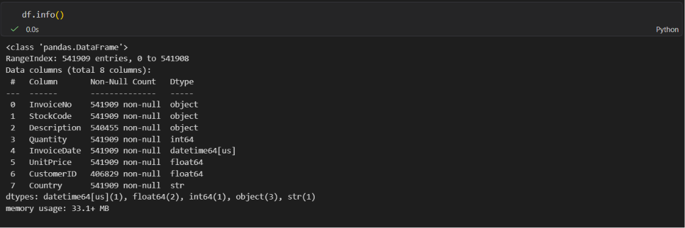

### Statistical Summary

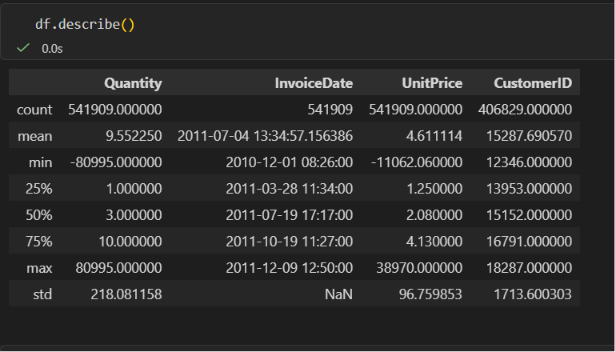

### Categorical Summary

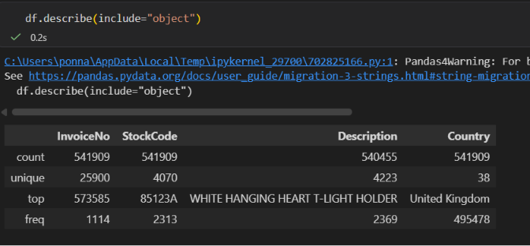

### Missing Value Analysis

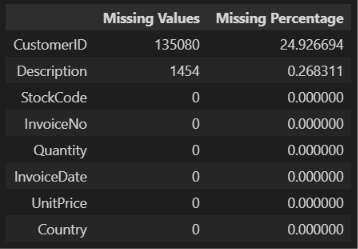

### Duplicate Analysis

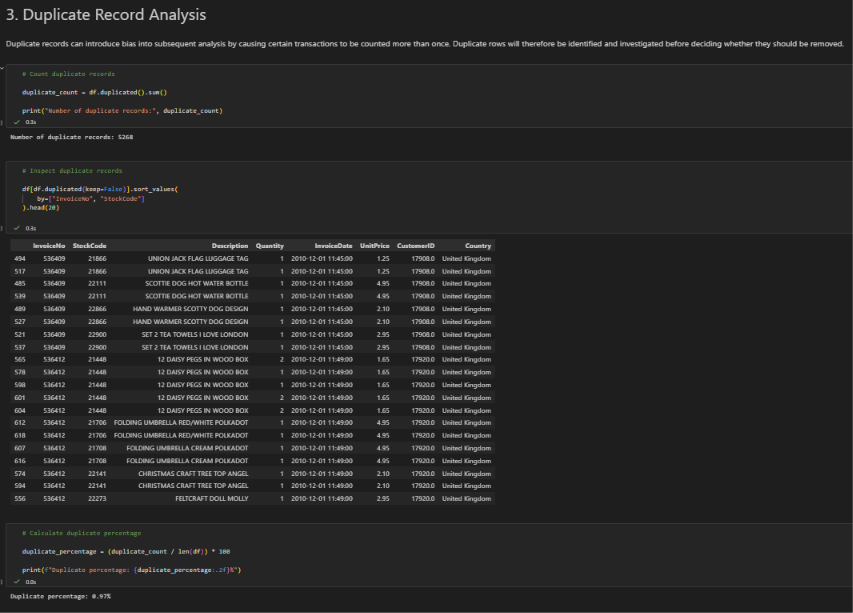

### Duplicate Validation


### Negative Quantity Investigation

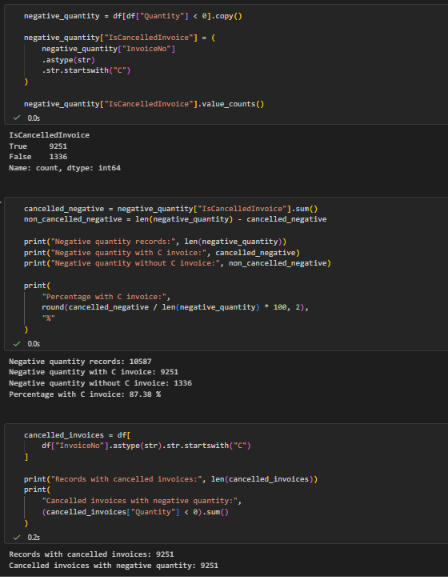

### Non-Cancelled Negative Quantity Analysis

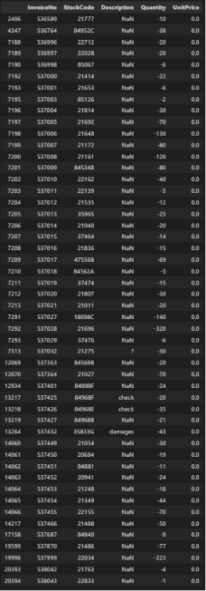

### Invalid Record Removal

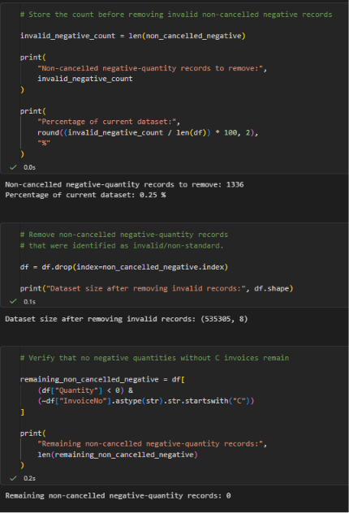

### UnitPrice Validation

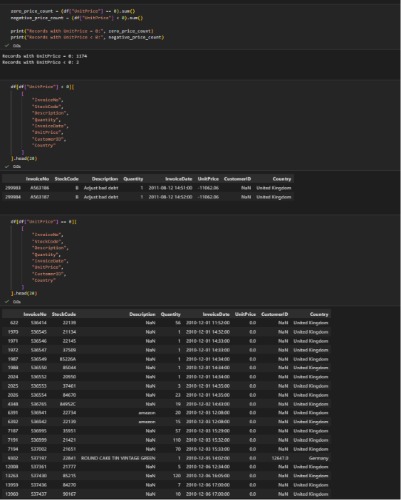

### Zero-Price Investigation

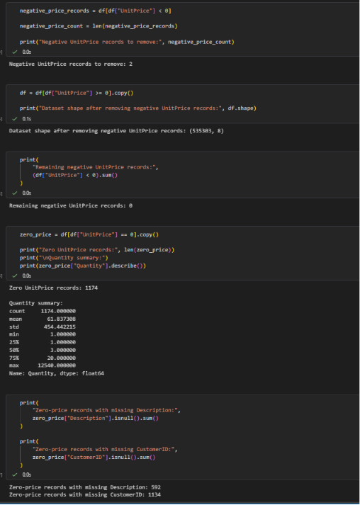

### InvoiceDate Validation

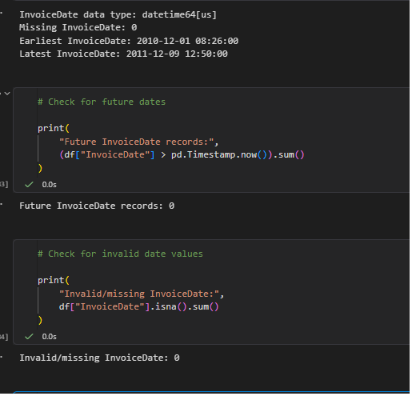

### Date Feature Extraction

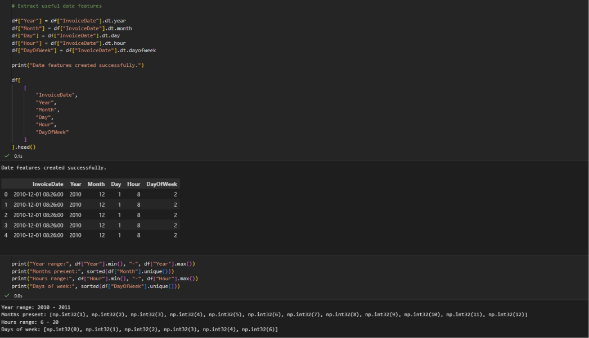

### Final Data Quality Check

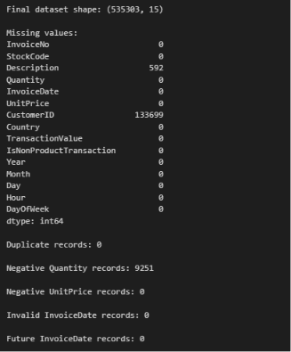

### Final Processed Dataset

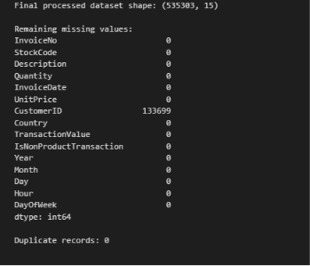

### Processed Dataset Saved

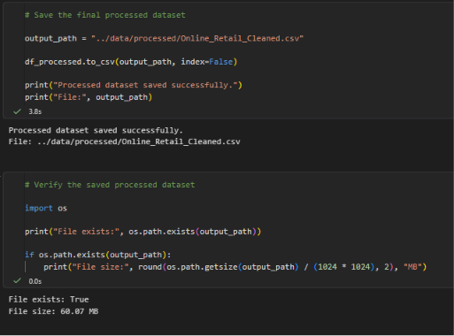

---

# 📁 Project Structure

```text
Online-Retail-Data-Cleaning/
│
├── data/
│   └── processed/
│       └── Online_Retail_Cleaned.csv
│
├── notebooks/
│   └── Week_1_Data_Cleaning.ipynb
│
├── screenshots/
│   ├── 01_dataset_loading.png
│   ├── 02_dataset_structure.png
│   ├── 03_statistical_summary.png
│   ├── 04_categorical_summary.png
│   ├── 05_missing_value_analysis.png
│   ├── 06_duplicate_analysis.png
│   ├── 07_duplicate_validation.png
│   ├── 08_negative_quantity_investigation.png
│   ├── 09_non_cancelled_negative_analysis.png
│   ├── 10_invalid_record_removal.png
│   ├── 11_unitprice_validation.png
│   ├── 12_zero_price_investigation_img1.png
│   ├── 13_invoice_date_validation.png
│   ├── 14_date_feature_extraction.png
│   ├── 15_final_data_quality_check.png
│   ├── 16_final_processed_dataset.png
│   └── 17_processed_dataset_saved.png
│
├── .gitignore
├── README.md
└── requirements.txt
```

---

# 🛠️ Technologies Used

- **Python**
- **Pandas**
- **NumPy**
- **Matplotlib**
- **Seaborn**
- **OpenPyXL**
- **Jupyter Notebook**
- **VS Code**

---

# ▶️ How to Run

### 1. Clone the repository

```bash
git clone https://github.com/rajashekar737/Online-Retail-Data-Cleaning.git
```

### 2. Navigate to the project

```bash
cd Online-Retail-Data-Cleaning
```

### 3. Create a virtual environment

```bash
python -m venv venv
```

### 4. Activate the environment

Windows:

```bash
venv\Scripts\activate
```

### 5. Install dependencies

```bash
pip install -r requirements.txt
```

### 6. Open the notebook

Open:

```text
notebooks/Week_1_Data_Cleaning.ipynb
```

Run the notebook cells sequentially.

---

# 📚 Dataset Source

The dataset was obtained from the **UCI Machine Learning Repository – Online Retail Dataset**.

Dataset source:

https://archive.ics.uci.edu/dataset/352/online+retail

---

# 🎓 Internship Task

**Internship:** Virtual Data Science with Python Trainee

**Task:** Week 1 – Data Acquisition, Cleaning, and Preprocessing

The project demonstrates the required skills of:

- Public dataset acquisition
- Data exploration
- Missing-value handling
- Duplicate detection
- Outlier investigation
- Erroneous-entry handling
- Data preprocessing
- Documentation
- Reflective analysis of preprocessing decisions

---

# 👤 Author

**Ponnam Raja Shekar**

B.Tech — Computer Science & Data Science

GitHub: https://github.com/rajashekar737

---

# ⭐ Project Outcome

The project demonstrates a structured and transparent approach to real-world data cleaning.

Rather than automatically removing unusual observations, the workflow investigates their meaning and applies preprocessing decisions based on **data quality and business context**.

The resulting dataset is prepared for further exploratory data analysis, visualization, and machine-learning workflows.
